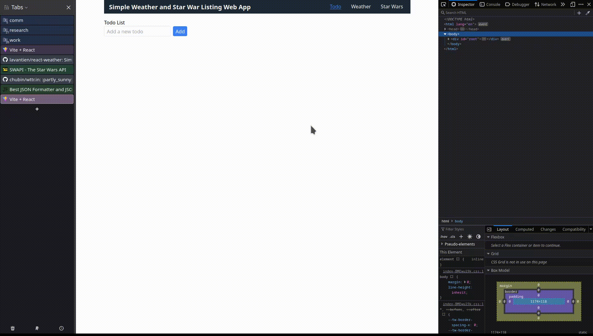

# React + Vite + Tailwind

## Simple Todo, Weather and Star War Listing Web App



**Description**

This web application leverages Vite, ReactJS, and Tailwind CSS to deliver three key functionalities:

1. **Navigation Menu:** Seamlessly switch between Todo List, Weather Forecast, and Star Wars Character Search pages.
2. **Todo List:** Manage your tasks efficiently. Add, edit, remove, and mark items as complete.
3. **Weather Forecast:** Access real-time weather data for the chosen city. Utilizes the WttrIn API (no API key required!).
4. **Star Wars Character Search:** Discover characters from the Star Wars universe via the SWAPI API. Search and filter characters directly on the screen.
5. **Dockerized Deployment:** Deploy the application easily in containerized environments using Docker.

**Getting Started**

1. **Prerequisites:**

   - Node.js
   - npm (bundled with Node.js installation)
   - Docker

2. **Clone the Repository:**

   ```bash
   git clone [Your Repository URL]
   cd [Your Project Directory]
   ```

3. **Install Dependencies:**

   ```bash
   npm install
   ```

4. **Development Server:**

   Start the development server for live coding and testing:

   ```bash
   npm run dev
   ```

   This opens the application in your default browser <http://localhost:3000/>.

**Run Build**

To create an optimized production build:

```bash
npm run build
```

The build artifacts will be placed in the `dist` folder.

**Dockerization**

For containerized deployment, Docker is recommended. Build the Docker image:

```bash
docker build -t react-weather .
```

**Run the Application in Docker:**

```bash
docker run -p 8080:80 react-weather
```

This exposes port 8080 on your host machine, mapping it to port 3000 inside the container. Access the application at http://localhost:8080/.

**API**

- The weather forecast utilizes the WttrIn JSON API: <https://github.com/chubin/wttr.in?tab=readme-ov-file#json-output>

We recommend writing comprehensive tests for components, functions, and API interactions to ensure code quality and maintainability.

**Code Structure**

The project follows a well-organized structure using React components:

- `src/` (source directory):
  - `App.js`: Main application component.
  - `components/`: Reusable React components for navigation, todo list, weather, and Star Wars search.
  - `utils/`: Utility functions for API interactions, data formatting, etc.
  - `styles/`: Tailwind CSS configuration and custom styles.
  - `tests/`: Unit tests for components and utilities (optional but recommended).

**Deployment**

Deploy the production build (in the `dist` folder) to your preferred hosting provider. If utilizing Docker, follow the containerization instructions provided.

**Further Enhancements**

- Add tests.
- Implement user authentication and data persistence.
- Add visual appeal and interactive elements using UI libraries.
- Enhance error handling and user feedback.
- Consider server-side rendering (SSR) for improved SEO and performance on slower connections.

**Mobile Responsiveness**

Tailwind CSS is designed for mobile-first development, ensuring responsiveness across various screen sizes. Test the application thoroughly on different devices to optimize the user experience.
